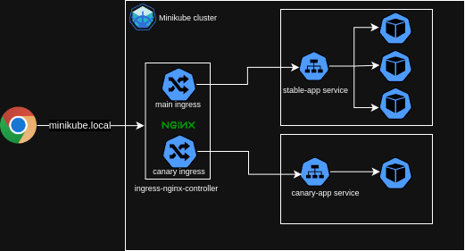

# Kubernetes Canary Deployment Demo

This project demonstrates basic Kubernetes concepts, focusing on simulating a basic environment suitable for a deployment following the canary strategy.

The idea for this demo came up from this [blog](https://blog.devops.dev/kubernetes-deployment-strategies-part-2-ec2290717fcb)

## Infrastructure

  

## Prerequisites

1. [Minikube](https://minikube.sigs.k8s.io/docs/start/) (to create a local cluster)
2. [Kubectl](https://kubernetes.io/docs/tasks/tools/) (to interact with the cluster)
3. [Lens](https://k8slens.dev/) (optional but recommended, to manage the cluster)
4. Run `minikube addons enable ingress` (to allow your minikube cluster to use the ingress controller)
5. Run `kubectl config use-context minikube` (to set minikube as the kubectl commands context)
6. In order to the dns to work we need to add the following to the /etc/hosts file: `<minikube ip> minikube.local`
  Where `<minikube ip>` is the IP address of your Minikube cluster. You can obtain it by running:
  `minikube ip`

## How It Works

1. **User Request**: A user sends a request to `http://minikube.local/`.

2. **Ingress Controller**:
- Two Ingress resources are defined:
  - Stable version
  - Canary version (marked with `nginx.ingress.kubernetes.io/canary: "true"`)
- Canary version specifies a weight: `nginx.ingress.kubernetes.io/canary-weight: "50"`
- NGINX Ingress Controller routes traffic based on these rules

3. **Traffic Splitting**:
- 50% of traffic goes to the stable version
- 50% of traffic goes to the canary version

4. **Service Selection**: Based on the Ingress rules, requests are forwarded to either the `stable-app` or `canary-app` service.

5. **Pod Processing**: The selected pod processes the request and sends the response back through the same path.

## NGINX Ingress Controller

- Acts as a reverse proxy and load balancer
- Interprets Kubernetes Ingress resources
- Configures NGINX to route traffic based on defined rules
- Supports canary deployments through special annotations

## Canary Deployment Benefits

- Allows testing of new versions with a portion of traffic
- Enables gradual rollout of changes
- Facilitates monitoring of impact before full deployment

## Additional Resources

For more detailed information on NGINX Ingress Controller and canary deployments, refer to the [official documentation](https://kubernetes.github.io/ingress-nginx/examples/canary/).
